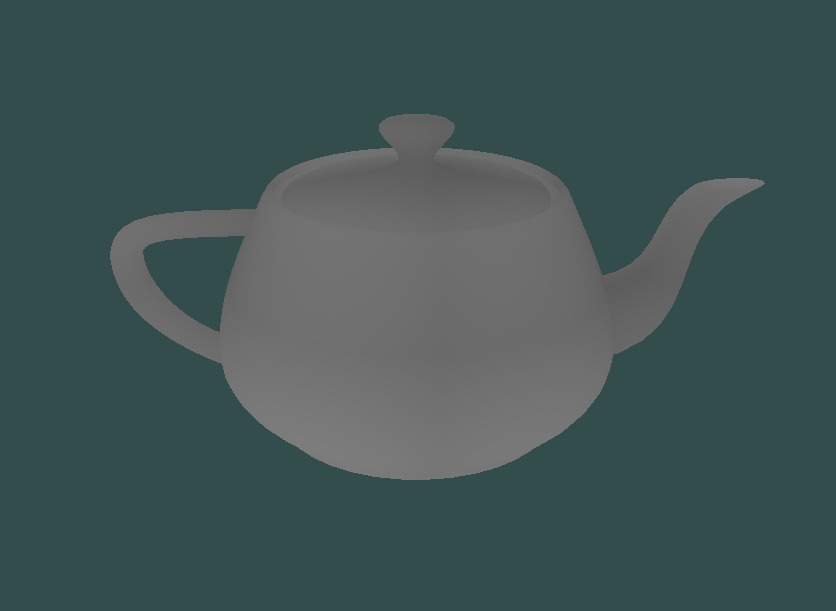
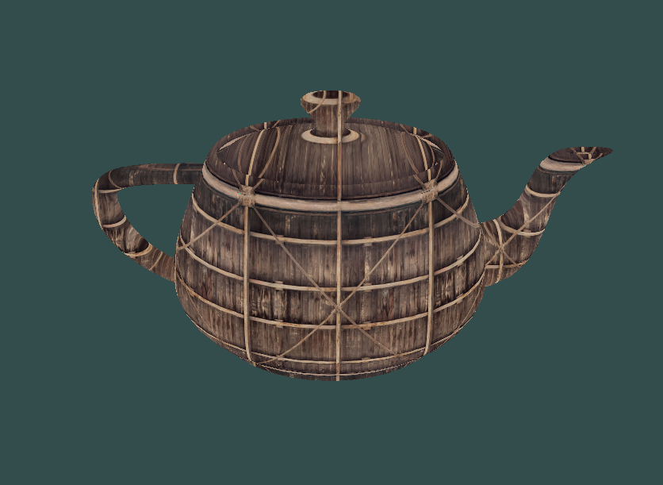
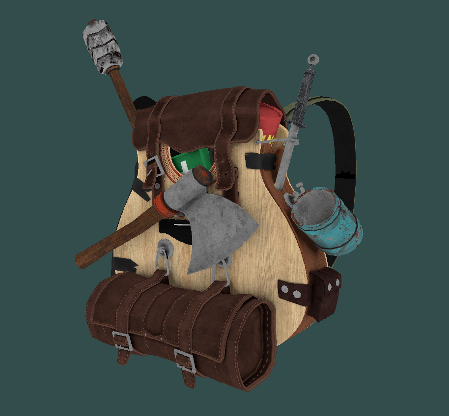

<h1 align="center">📖 42 SCOP</h1>

## Description

This project is an introduction to OpenGL. The objective is to create an app capable of rendering 3D wavefront obj file, and of applying them textures (only .BMP) by using C++ and OpenGL. 
 

## Setup
Requirements: `OpenGL version >= 3.3`. 

Path for objects and textures if you want to add yours : `scop/resources/obj` and `scop/resources/textures`  

Args : `./scop [object] [texture]` without the file extension.

## Keys

`Escape`: Quit the program. 
`WASD`: Move object. 
`T` : Apply the texture. 
`C`: Switch to free camera mode with the mouse. 
`Z`: Switch to wireframe mode. 

## How it looks

- without vt mapping in obj file: 
`./scop teapot t_container` 

 
You can press `t` to apply a texture :
   

 

- With vt mapping in obj file: 
`./scop backpack t_backpack`, Then press `t` to activate texture, then `KP 7` to use vt mapping described in the obj file, then `KP 8` to flip the texture (some obj need the texture to be flipped.). 

 
